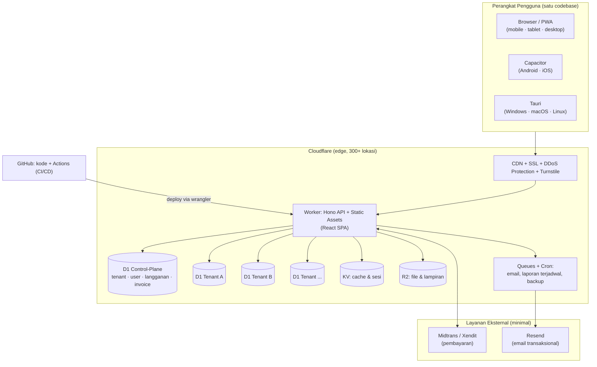
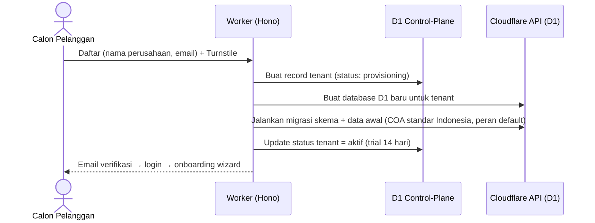
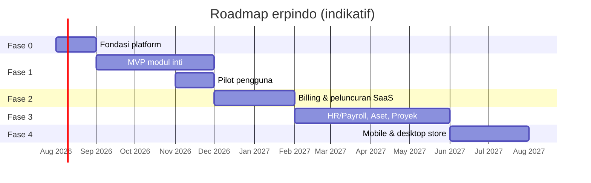

# Rencana Pengembangan Komprehensif — erpindo

ERP modern multi-tenant (SaaS) untuk UMKM & perusahaan menengah Indonesia, dibangun sepenuhnya di atas **GitHub + Cloudflare**.

> Latar belakang keputusan-keputusan di dokumen ini dijelaskan di [01-tanya-jawab-fundamental.md](./01-tanya-jawab-fundamental.md).

## Daftar Isi

1. [Arsitektur Sistem](#1-arsitektur-sistem)
2. [Rincian Modul](#2-rincian-modul)
3. [Pilihan Stack & Alasan](#3-pilihan-stack--alasan)
4. [Strategi Multi-Tenant & Monetisasi](#4-strategi-multi-tenant--monetisasi)
5. [Keamanan](#5-keamanan)
6. [Langkah Pengembangan & Roadmap](#6-langkah-pengembangan--roadmap)
7. [Catatan Realistis untuk Pemilik Non-Programmer](#7-catatan-realistis-untuk-pemilik-non-programmer)

---

## 1. Arsitektur Sistem

### 1.1 Gambaran Besar



**Prinsip arsitektur:**

- **Satu Worker, banyak database.** Worker Hono melayani API dan aplikasi web sekaligus. Setiap request diberi konteks tenant (dari subdomain `namaperusahaan.erpindo.id` atau dari sesi), lalu diarahkan ke database D1 milik tenant tersebut.
- **Control-plane vs data-plane.** Database pusat hanya menyimpan hal lintas-tenant (akun, tenant, langganan, tagihan). Seluruh data bisnis (jurnal, faktur, stok) hidup di database masing-masing tenant.
- **Semua jalur async lewat Queues** — kirim email, generate laporan besar, backup — agar request pengguna selalu cepat.

### 1.2 Alur Pendaftaran Tenant Baru (Provisioning)



### 1.3 Alur Request Harian

1. Pengguna membuka `pt-maju.erpindo.id` → CDN menyajikan aset SPA (instan, tercache).
2. SPA memanggil API `api.erpindo.id` dengan cookie sesi.
3. Middleware Hono: verifikasi sesi → resolve tenant → cek langganan aktif → cek RBAC.
4. Handler mengeksekusi query Drizzle ke D1 tenant → respons JSON → TanStack Query menyimpan cache di klien.

### 1.4 Struktur Monorepo

```
erpindo/
├── apps/
│   ├── api/          # Hono di Cloudflare Workers (wrangler.toml)
│   └── web/          # React + Vite SPA (PWA)
├── packages/
│   ├── db/           # Skema Drizzle + migrasi (control-plane & tenant)
│   ├── shared/       # Skema Zod, tipe, konstanta (dipakai api & web)
│   └── ui/           # Design system: komponen shadcn/ui + tokens
├── docs/             # Dokumen perencanaan (folder ini)
└── .github/workflows # CI/CD
```

---

## 2. Rincian Modul

Legenda prioritas: **MVP** = wajib rilis pertama · **v2** = setelah komersial · **v3** = jangka panjang.

### 2.1 Fondasi Platform (bukan modul bisnis, tapi prasyarat semua modul) — MVP

| Kemampuan | Isi |
|---|---|
| Autentikasi | Registrasi, login, verifikasi email, reset password, 2FA TOTP, manajemen sesi |
| Tenant & Organisasi | Profil perusahaan, logo, NPWP, periode fiskal, mata uang (IDR default), multi-cabang (v2) |
| Pengguna & RBAC | Undang pengguna, peran bawaan (Owner, Admin, Akuntan, Sales, Gudang, Viewer), izin per modul/aksi |
| Audit Log | Catatan siapa-kapan-apa untuk semua perubahan data penting |
| Notifikasi | In-app + email (approval, stok minimum, tagihan jatuh tempo) |

### 2.2 Keuangan & Akuntansi — MVP (jantung sistem)

| Fitur | Entitas Utama | Catatan |
|---|---|---|
| Bagan Akun (COA) | `accounts` | Template COA standar Indonesia siap pakai, bisa dikustom |
| Jurnal Umum & Buku Besar | `journal_entries`, `journal_lines` | Double-entry ketat: total debit = kredit divalidasi server; jurnal terposting **immutable** (koreksi via jurnal pembalik) |
| Kas & Bank | `cash_accounts`, `payments` | Penerimaan/pengeluaran, transfer antar kas, rekonsiliasi manual (impor mutasi CSV di v2) |
| Piutang & Hutang | terintegrasi faktur | Umur piutang/hutang (aging), pencatatan pelunasan parsial |
| Pajak | `tax_rates`, `tax_lines` | PPN 11/12%, PPh 23, PPh final UMKM 0,5%; rekap untuk pelaporan |
| Laporan Keuangan | — | Neraca, Laba-Rugi, Arus Kas, Trial Balance; per periode; ekspor Excel/PDF |
| Tutup Buku | `fiscal_periods` | Kunci periode agar data historis tidak berubah |

### 2.3 Penjualan & CRM — MVP

- Master pelanggan (kontak, NPWP, termin, limit kredit).
- Alur: **Quotation → Sales Order → Pengiriman → Invoice → Pelunasan** (boleh lompat, mis. langsung invoice).
- Invoice PDF dengan logo perusahaan, nomor urut otomatis, PPN otomatis.
- Otomasi silang-modul: invoice terbit → jurnal piutang & pendapatan + pengurangan stok.
- Laporan: penjualan per pelanggan/produk/periode, piutang jatuh tempo.

### 2.4 Pembelian — MVP

- Master pemasok; alur **PR → PO → Penerimaan Barang → Faktur Pembelian → Pembayaran**.
- Approval berjenjang untuk PO di atas nominal tertentu.
- Otomasi: penerimaan barang → stok bertambah + jurnal persediaan/hutang.

### 2.5 Inventori & Gudang — MVP

- Master produk (SKU, barcode, satuan & konversi satuan, kategori, harga jual/beli).
- Stok real-time per gudang; transfer antar gudang; penyesuaian & stok opname.
- Penilaian persediaan **average cost** (MVP) — FIFO di v2.
- Peringatan stok minimum; kartu stok (riwayat mutasi per barang).

### 2.6 Pelaporan & Dashboard — MVP

- Dashboard beranda: kas hari ini, penjualan bulan berjalan, piutang/hutang jatuh tempo, produk terlaris, grafik tren.
- Semua laporan dapat difilter (periode, cabang, gudang) dan diekspor Excel/PDF (digenerate via Queue untuk laporan besar).

### 2.7 Modul v2

| Modul | Fitur inti |
|---|---|
| **POS (Point of Sale / Kasir)** — prioritas tertinggi v2 | Layar kasir cepat untuk retail & F&B; **offline-first** (PWA menyimpan transaksi lokal, sinkron saat online kembali); struk printer thermal (Web Bluetooth/USB); pembayaran tunai, QRIS, EDC; sesi shift & rekap kas; diskon & promo; otomatis memotong stok dan membuat jurnal penjualan. Segmen retail/F&B adalah pasar UMKM terbesar di Indonesia — POS sering menjadi pintu masuk pelanggan sebelum memakai modul lain |
| **HR & Payroll** | Data karyawan & kontrak, absensi & cuti, komponen gaji, hitung otomatis PPh 21 (TER) + BPJS Kesehatan/JHT/JP/JKK/JKM, slip gaji PDF, jurnal beban gaji otomatis |
| **CRM Pipeline** | Lead & sumber lead, peluang (opportunity) dengan tahapan funnel, aktivitas & pengingat follow-up, konversi peluang → quotation; melengkapi master pelanggan yang sudah ada di MVP |
| **Aset Tetap** | Registrasi aset, penyusutan garis lurus/saldo menurun otomatis per bulan (Cron), pelepasan/penjualan aset |
| **Anggaran (Budgeting)** | Anggaran per akun/departemen/proyek per periode, laporan budget vs realisasi, peringatan saat mendekati batas |
| **Inventori Lanjutan** | Batch/lot & nomor seri, tanggal kedaluwarsa + peringatan (wajib untuk F&B, farmasi, kosmetik), penilaian FIFO |
| **Manajemen Dokumen** | Lampiran terpusat di R2 melekat ke transaksi/master (kontrak, faktur pajak, bukti transfer), pratinjau, kontrol akses mengikuti RBAC |
| **Workflow & Approval Engine** | Aturan persetujuan berjenjang yang dapat dikustom per tenant (mis. PO > Rp X butuh 2 approver, diskon > Y% butuh manajer) — dipakai lintas modul, dibangun sekali sebagai fondasi |
| **Proyek** | Proyek & tugas, biaya dan pendapatan per proyek, profitabilitas proyek |
| **Integrasi dasar** | Impor rekening koran (rekonsiliasi), API publik + webhook |

### 2.8 Modul v3

| Modul | Fitur inti |
|---|---|
| **Integrasi E-commerce & Marketplace** | Sinkronisasi produk, stok, dan pesanan dengan Tokopedia, Shopee, TikTok Shop; pesanan marketplace otomatis menjadi SO + jurnal; rekonsiliasi dana settlement |
| **Pengiriman & Ekspedisi** | Integrasi kurir (JNE, J&T, SiCepat — via agregator seperti Biteship agar satu integrasi mencakup banyak kurir), cek ongkir saat membuat SO, cetak label, tracking resi |
| **Manufaktur** | BoM bertingkat, perintah produksi, konsumsi bahan, biaya produksi |
| **QC (Quality Control)** | Rencana inspeksi, pemeriksaan saat penerimaan barang & hasil produksi, karantina barang gagal |
| **Maintenance (Pemeliharaan)** | Jadwal servis preventif mesin/kendaraan/aset (Cron), work order perbaikan, riwayat & biaya per aset — terhubung modul Aset Tetap |
| **Multi Mata Uang** | Master kurs (update otomatis), transaksi valas, laba/rugi selisih kurs, revaluasi saldo |
| **Helpdesk / Layanan Pelanggan** | Tiket via email/form, prioritas & SLA, riwayat terhubung ke pelanggan dan penjualan |
| **Kontrak & Penagihan Berulang** | Kontrak berlangganan pelanggan tenant, recurring invoice otomatis (Cron), pengingat perpanjangan |
| **Konsolidasi Multi-Perusahaan** | Beberapa entitas legal dalam satu grup, transaksi antar-perusahaan, laporan keuangan konsolidasi — fitur paket Enterprise |
| **e-Faktur/Coretax** | Pelaporan pajak elektronik, menyesuaikan regulasi DJP saat implementasi |
| **BI lanjutan** | Report builder kustom, penjadwalan laporan email |

### 2.9 Modul yang Sengaja di Luar Cakupan

Agar fokus dan kualitas terjaga, beberapa domain **tidak** direncanakan: koperasi simpan-pinjam, rental/persewaan khusus, properti/strata, rumah sakit/klinik, dan sekolah (SIS). Domain-domain ini punya regulasi dan alur yang sangat spesifik — lebih tepat digarap sebagai produk vertikal terpisah bila kelak ada peluang, bukan ditempelkan ke ERP umum.

---

## 3. Pilihan Stack & Alasan

### 3.1 Stack Terpilih

| Lapisan | Teknologi | Alasan utama |
|---|---|---|
| Bahasa | TypeScript | Satu bahasa FE+BE; type-safety = lebih sedikit bug di sistem finansial |
| API | Hono @ Cloudflare Workers | Ringan (ideal untuk edge), API mirip Express (mudah cari developer), cold start ~0 ms |
| ORM/DB | Drizzle + D1 (SQLite) | Query type-safe, migrasi terkelola; D1 murah dan mendukung ribuan DB → pas untuk per-tenant |
| Frontend | React 19 + Vite | Ekosistem terbesar; shadcn/ui berbasis React |
| Data-fetching | TanStack Query + Router | Cache, retry, optimistic update tanpa kode boilerplate |
| UI | Tailwind CSS 4 + shadcn/ui | Design system modern, dapat dikustom penuh, dark mode |
| Validasi | Zod | Satu skema dipakai form (FE) dan endpoint (BE) |
| PWA | vite-plugin-pwa (Workbox) | Installable + offline cache dengan konfigurasi minim |
| File | R2 | Tanpa biaya egress; presigned URL untuk unduh aman |
| Background job | Queues + Cron Triggers | Email, laporan besar, penyusutan bulanan, backup |
| CI/CD | GitHub Actions + wrangler | Push ke `main` → test → deploy otomatis |
| Testing | Vitest + Playwright | Unit/integration cepat; E2E lintas-browser |

### 3.2 Alternatif yang Dipertimbangkan (dan kenapa tidak)

| Alternatif | Kenapa tidak dipilih |
|---|---|
| **Next.js (full-stack)** | Fitur SSR-nya tidak dibutuhkan aplikasi internal ber-login; SPA + API terpisah lebih sederhana dan lebih portabel di Workers |
| **PostgreSQL (Neon/Supabase)** | Menambah vendor di luar GitHub+Cloudflare; model per-tenant di D1 memberi isolasi lebih kuat dengan biaya lebih rendah. Bisa dipertimbangkan lagi via **Hyperdrive** jika kelak ada tenant raksasa |
| **AWS/GCP/Azure** | Biaya dasar & kompleksitas operasional jauh lebih tinggi; bertentangan dengan batasan "GitHub + Cloudflare saja" |
| **Laravel/Django** | Butuh server selalu menyala (VPS/kontainer); dua bahasa; tidak jalan di Workers |
| **Flutter/React Native** | Dua codebase (web + mobile); PWA + Capacitor memberi hasil setara untuk aplikasi form-driven seperti ERP |

### 3.3 Batasan D1 yang Sudah Diperhitungkan

- **10 GB per database** → per-tenant, satu UMKM sangat jarang melewati ini; jika terjadi: arsip data lama ke R2 atau tenant di-upgrade ke DB khusus via Hyperdrive.
- **Satu writer per database** → penulisan per tenant bersifat serial; untuk beban UMKM (puluhan transaksi/menit) sangat cukup, dan antar-tenant tetap paralel penuh.
- **Ukuran respons/CPU Workers terbatas** → laporan besar dan ekspor dikerjakan lewat Queues, hasil disimpan di R2.

---

## 4. Strategi Multi-Tenant & Monetisasi

### 4.1 Model Multi-Tenant

- **Database-per-tenant** (lihat §1). Identifikasi tenant via subdomain (`pt-maju.erpindo.id`) — profesional dan memudahkan SSO per perusahaan.
- **Control-plane** (D1 pusat), tabel inti:
  - `tenants` — id, nama, subdomain, id database D1, status (trial/aktif/menunggak/suspended), plan.
  - `users` — akun global (satu email bisa menjadi anggota beberapa tenant).
  - `memberships` — user ↔ tenant + peran.
  - `subscriptions` — plan, siklus (bulanan/tahunan), tanggal mulai/berakhir, status.
  - `invoices_saas` + `payments_saas` — tagihan langganan & pembayaran gateway.
  - `usage_metrics` — jumlah pengguna/transaksi/penyimpanan per tenant (dasar penegakan limit & analitik).
- **Migrasi skema tenant** dijalankan bergilir oleh job saat rilis versi baru; kolom `schema_version` di `tenants` melacak progres.

### 4.2 Paket & Harga (hipotesis awal — divalidasi saat riset pasar)

| | **Trial** | **Starter** | **Business** | **Enterprise** |
|---|---|---|---|---|
| Harga/bulan | Gratis 14 hari | Rp 149.000 | Rp 599.000 | Custom |
| Pengguna | 2 | 3 | 15 | Tak terbatas |
| Modul | Semua (uji coba) | Inti (Keuangan, Jual, Beli, Stok) | + HR/Payroll, Aset, multi-gudang | + SLA, onboarding khusus, API |
| Penyimpanan file | 100 MB | 1 GB | 10 GB | Custom |

- Diskon ~2 bulan untuk pembayaran tahunan.
- Penegakan limit dilakukan middleware berdasarkan `usage_metrics` (mis. tombol "tambah pengguna" mengarah ke halaman upgrade).

### 4.3 Alur Billing

1. Cron harian memeriksa langganan yang akan berakhir → membuat tagihan + email (Queue).
2. Pelanggan membayar via Midtrans/Xendit (VA, QRIS, e-wallet, kartu) → **webhook** gateway ke Worker → verifikasi signature → tandai lunas → perpanjang langganan.
3. Menunggak: masa tenggang 7 hari (banner peringatan) → mode **read-only** → suspend setelah 30 hari (data disimpan 90 hari sebelum dihapus, sesuai kebijakan yang dikomunikasikan).

### 4.4 Jalur Pendapatan Tambahan (nanti)

Onboarding/pelatihan berbayar, jasa migrasi data dari Excel/aplikasi lain, add-on (integrasi marketplace, e-Faktur), program referral/reseller untuk konsultan pajak & akuntan.

---

## 5. Keamanan

Ringkasan berlapis (detail per lapisan di [dok 01 §8](./01-tanya-jawab-fundamental.md#8-bagaimana-aspek-keamanan-dari-awal-hingga-deployment)):

| Lapisan | Kontrol |
|---|---|
| Data | Isolasi DB per tenant; backup Time Travel + ekspor mingguan ke R2; enkripsi at-rest (bawaan Cloudflare) |
| Identitas | Argon2, sesi HttpOnly+Secure+SameSite, 2FA TOTP, kebijakan password, lockout percobaan gagal |
| Otorisasi | RBAC dicek server-side di setiap endpoint; jurnal terposting immutable; periode terkunci |
| Aplikasi | Zod di semua input; Drizzle (parameterized); CSP/HSTS; CSRF token; upload dibatasi tipe & ukuran |
| Jaringan | HTTPS paksa, rate limiting, Turnstile, proteksi DDoS Cloudflare |
| Supply chain | Dependabot, `pnpm audit` di CI, secret scanning, branch protection + review wajib |
| Operasional | `wrangler secret` untuk semua kredensial; log akses; prosedur insiden & pemberitahuan pelanggan |

---

## 6. Langkah Pengembangan & Roadmap

Estimasi durasi mengasumsikan 1–2 developer full-time (atau setara, dengan bantuan AI coding). Setiap fase diakhiri demo yang bisa dicoba di URL nyata.

### Fase 0 — Fondasi ✅ (selesai 2 Jul 2026 — [log](./log/2026-07-02-fase-0.md))

- [x] Setup monorepo pnpm (struktur §1.4), Vitest.
- [x] CI/CD: GitHub Actions → typecheck + test + build + smoke test; job deploy `wrangler` aktif otomatis saat secret Cloudflare tersedia.
- [x] Worker Hono + React SPA berjalan (lokal tervalidasi; tayang di domain menunggu `CLOUDFLARE_API_TOKEN` — lihat [STATUS.md](./STATUS.md)).
- [x] Skema control-plane + autentikasi lengkap (register, login, verifikasi email, reset password; mailer console/Resend).
- [x] Provisioning tenant otomatis (database per tenant + migrasi; routing subdomain menyusul di Fase 2).
- [x] RBAC dasar + audit log.
- [x] Design system: tokens, layout aplikasi responsif, komponen inti, dark mode.

**Gerbang keluar:** ✅ terpenuhi — mendaftar perusahaan baru & login ke workspace aman, dibuktikan 22 pemeriksaan smoke test end-to-end di CI.

### Fase 1 — MVP Produk (± 3 bulan)

- [x] Bulan 1: master data (produk, pelanggan, pemasok, gudang), COA + template Indonesia, jurnal manual, buku besar — ✅ selesai 2 Jul 2026 ([log Fase 1a](./log/2026-07-02-fase-1a.md)), plus neraca saldo.
- [x] Bulan 2: siklus penjualan & pembelian dengan jurnal + mutasi stok otomatis (moving average), pembayaran & PPN — ✅ selesai 3 Jul 2026 ([log Fase 1b](./log/2026-07-03-fase-1b.md)); PDF invoice & impor rekening menyusul di Fase 1c/2.
- [ ] Bulan 3: laporan keuangan (neraca, L/R, arus kas), kartu stok & aging, dashboard, ekspor Excel/PDF, tutup buku; PWA dasar (installable); pengujian E2E alur kritis.
- [ ] Pilot dengan 3–5 bisnis nyata (gratis) → perbaikan dari umpan balik.

**Gerbang keluar:** satu UMKM dapat menjalankan operasional hariannya penuh di erpindo.

### Fase 2 — SaaS Komersial (± 2 bulan)

- [ ] Landing page + pendaftaran self-service + onboarding wizard (impor data awal dari template Excel).
- [ ] Billing: paket & limit, integrasi Midtrans/Xendit, webhook, dunning (tenggang → read-only → suspend).
- [ ] PWA penuh (offline cache halaman & data referensi), notifikasi in-app/email.
- [ ] Hardening: rate limiting, Turnstile, uji keamanan, kebijakan privasi & ToS.
- [ ] **Peluncuran komersial.**

### Fase 3 — Modul Lanjutan / v2 (3+ bulan, berkelanjutan)

Urutan di dalam fase ini fleksibel — ikuti permintaan pelanggan berbayar. Usulan urutan awal:

- [ ] **POS** lebih dulu (permintaan pasar tertinggi, pintu masuk pelanggan retail/F&B) + Workflow/Approval Engine (fondasi yang dipakai modul lain).
- [ ] HR & Payroll (PPh 21 TER, BPJS) → Aset Tetap (penyusutan Cron) → CRM Pipeline → Anggaran → Proyek.
- [ ] Inventori lanjutan (batch/lot, kedaluwarsa, FIFO) + Manajemen Dokumen.
- [ ] Impor rekening koran & rekonsiliasi; API publik + webhook; multi-cabang.

### Fase 4 — Distribusi Native, Ekosistem & Skala (v3)

- [ ] Capacitor → Play Store & App Store (push notification, scan barcode kamera).
- [ ] Tauri → installer Windows/macOS.
- [ ] Integrasi marketplace (Tokopedia/Shopee/TikTok Shop) & ekspedisi (agregator kurir).
- [ ] Manufaktur + QC, Maintenance, multi mata uang, helpdesk, recurring billing, konsolidasi multi-perusahaan.
- [ ] e-Faktur/Coretax, report builder.



---

## 7. Catatan Realistis untuk Pemilik Non-Programmer

**Tiga jalur eksekusi (bisa dikombinasikan):**

1. **AI-assisted + belajar** — biaya terendah, paling lambat; realistis untuk Fase 0 dan prototipe, namun ERP produksi (akuntansi double-entry, billing, keamanan) tetap butuh review orang berpengalaman.
2. **Rekrut 1–2 developer** (full-time/freelance) dengan Anda sebagai product owner — jalur yang disarankan; dokumen ini menjadi brief kerja mereka.
3. **Agensi software** — tercepat namun termahal, dan pemeliharaan jangka panjang harus dinegosiasikan.

**Biaya operasional infrastruktur (di luar SDM):**

| Item | Perkiraan |
|---|---|
| Cloudflare Workers Paid (Workers, D1, R2, Queues) | mulai $5/bulan, tumbuh sesuai pemakaian |
| Domain `.id` / `.com` | ± Rp 300 rb/tahun |
| Resend (email) | gratis s.d. 3.000 email/bulan |
| Midtrans/Xendit | biaya per transaksi (± 0,7–2%) |
| GitHub | gratis (private repo termasuk) |

Artinya biaya tetap bulanan sebelum punya pelanggan **di bawah Rp 200 ribu** — sisanya mengikuti pertumbuhan.

**Hal non-teknis yang perlu disiapkan paralel:** badan usaha & rekening bisnis (syarat payment gateway), kebijakan privasi & ketentuan layanan (kepatuhan UU PDP), riset harga ke calon pengguna, dan konsultasi dengan akuntan untuk memvalidasi desain COA & alur jurnal sebelum Fase 1.

---

*Dokumen ini adalah blueprint hidup — perbarui seiring keputusan dan pembelajaran baru.*
