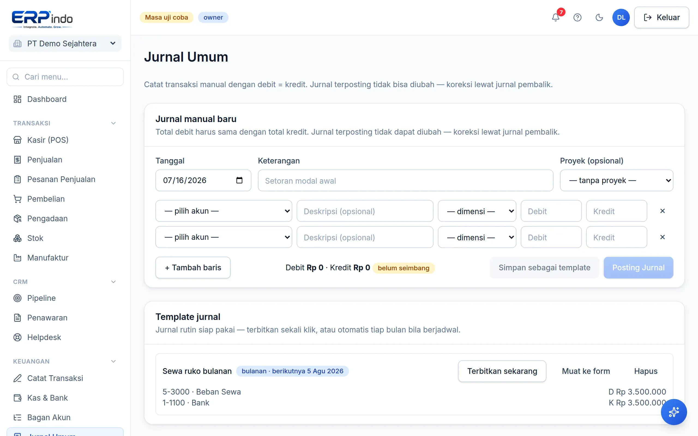
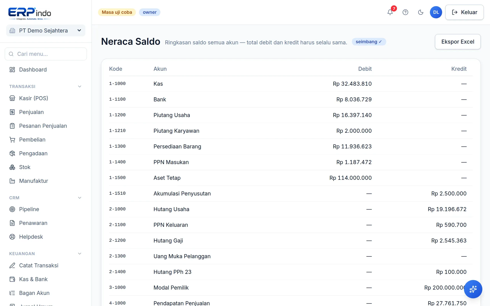

# Akuntansi & Jurnal

Fondasi erpindo adalah pembukuan double-entry sungguhan: setiap transaksi menjadi jurnal seimbang, buku besar per akun, dan neraca saldo yang dijamin balance.

> Buka di aplikasi: `/app/keuangan/jurnal`

## Bagan akun & jurnal umum

Bagan akun standar Indonesia (kas, bank, piutang, persediaan, PPN, modal, pendapatan, beban) sudah tersedia sejak daftar; Anda bisa menambah akun sendiri atau mengganti namanya (kode & tipe terkunci demi integritas laporan).

Sebagian besar jurnal dibuat otomatis oleh modul lain. Untuk pencatatan manual (mis. bayar listrik, setoran modal), pakai Jurnal Umum — sistem menolak jurnal yang tidak seimbang.

## Buku besar & neraca saldo

Buku besar menampilkan mutasi & saldo per akun. Neraca saldo merangkum semua akun — total debit selalu sama dengan total kredit; kalau tidak, sistemlah yang salah, bukan Anda (dan 390+ uji otomatis kami menjaganya).

> 💡 Jurnal terposting tidak bisa diedit (prinsip audit). Koreksi dilakukan lewat jurnal pembalik/void.
