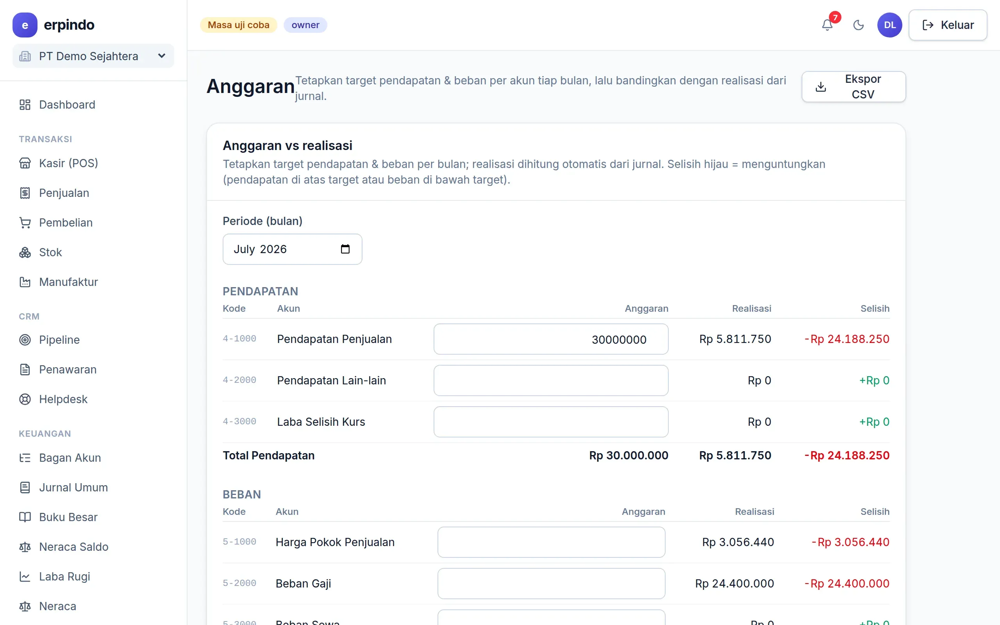

# Anggaran

Target pendapatan & beban per akun per bulan, dengan realisasi otomatis dari jurnal dan selisih berwarna.

> Buka di aplikasi: `/app/keuangan/anggaran`

## Menetapkan & memantau anggaran

1. Pilih bulan → isi angka anggaran di baris akun pendapatan/beban (tersimpan saat pindah kolom).
2. Kolom realisasi terisi otomatis dan selalu cocok dengan Laba Rugi bulan itu.

