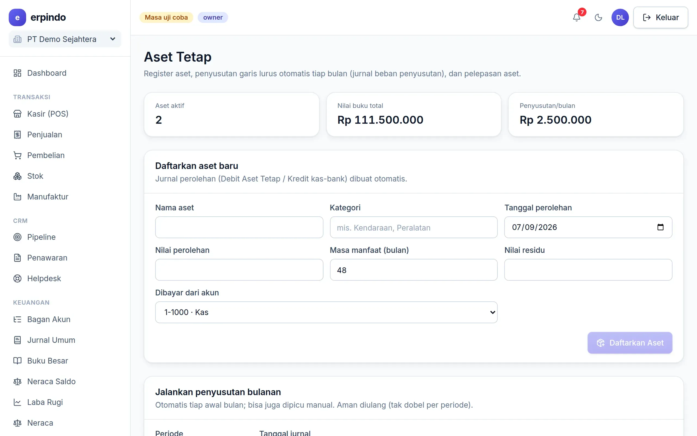

# Aset Tetap

Register kendaraan, mesin, dan peralatan — penyusutan garis lurus dijurnal otomatis tiap bulan, pelepasan aset menghitung laba/rugi sendiri.

> Buka di aplikasi: `/app/keuangan/aset`

## Mendaftarkan & menyusutkan aset

1. Daftarkan aset: nama, kategori, tanggal & harga perolehan, umur manfaat (bulan), nilai residu, akun pembayar.
2. Penyusutan bulanan berjalan otomatis (Cron) — akumulasi & nilai buku ikut terbarui, bebannya terjurnal.
3. Melepas/menjual aset: isi tanggal & harga jual — laba/rugi pelepasan dihitung dan dijurnal otomatis.

