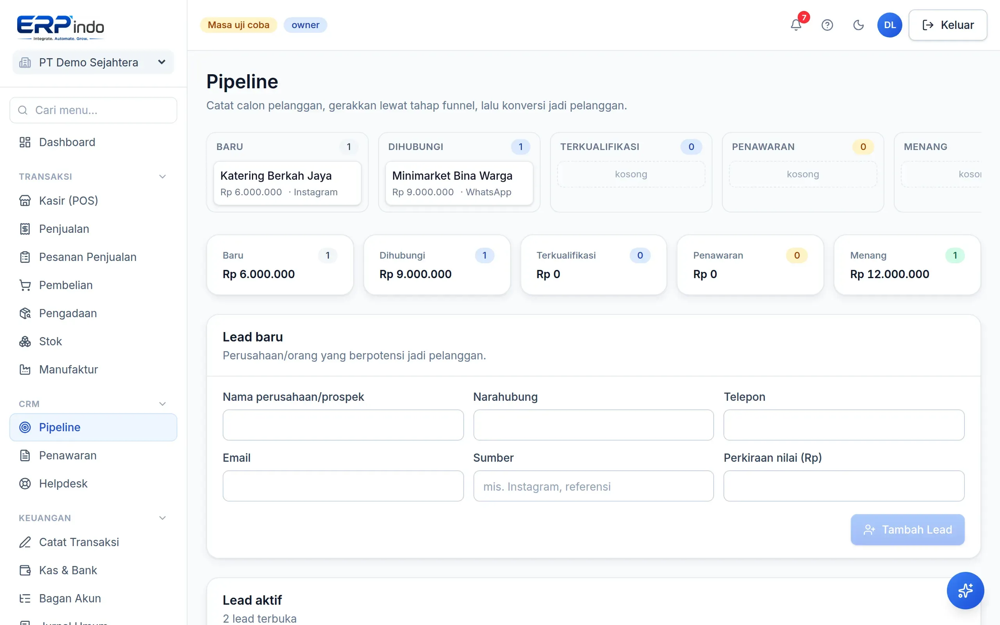
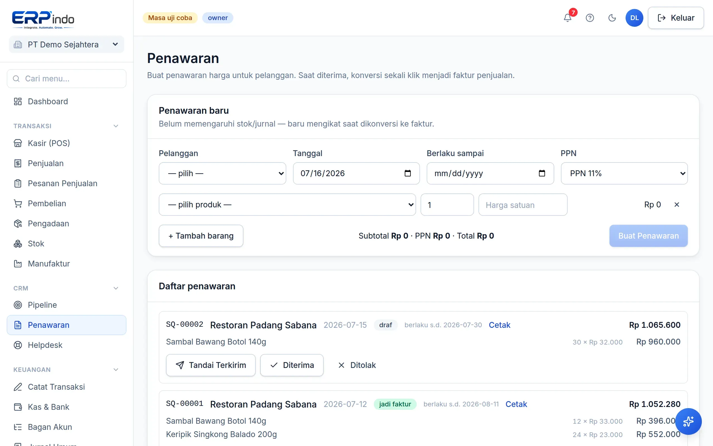

# CRM: Pipeline & Penawaran

Kelola calon pelanggan dari prospek sampai deal: tahapan funnel, catatan aktivitas, konversi menjadi pelanggan, dan penawaran yang berubah jadi faktur sekali klik.

> Buka di aplikasi: `/app/crm/leads`

## Pipeline lead

1. Catat lead beserta nilai potensinya; geser tahapan (baru → dihubungi → terkualifikasi → penawaran → menang/kalah).
2. Tambahkan aktivitas follow-up (telepon, meeting, catatan) agar riwayat komunikasi tersimpan.
3. Lead yang siap dikonversi menjadi Pelanggan otomatis masuk daftar kontak.

## Penawaran (quotation)

1. Buat penawaran berisi baris produk + PPN untuk pelanggan.
2. Saat disetujui pelanggan, tandai "Diterima" lalu Konversi — faktur penjualan terbit dengan stok & jurnal otomatis.

