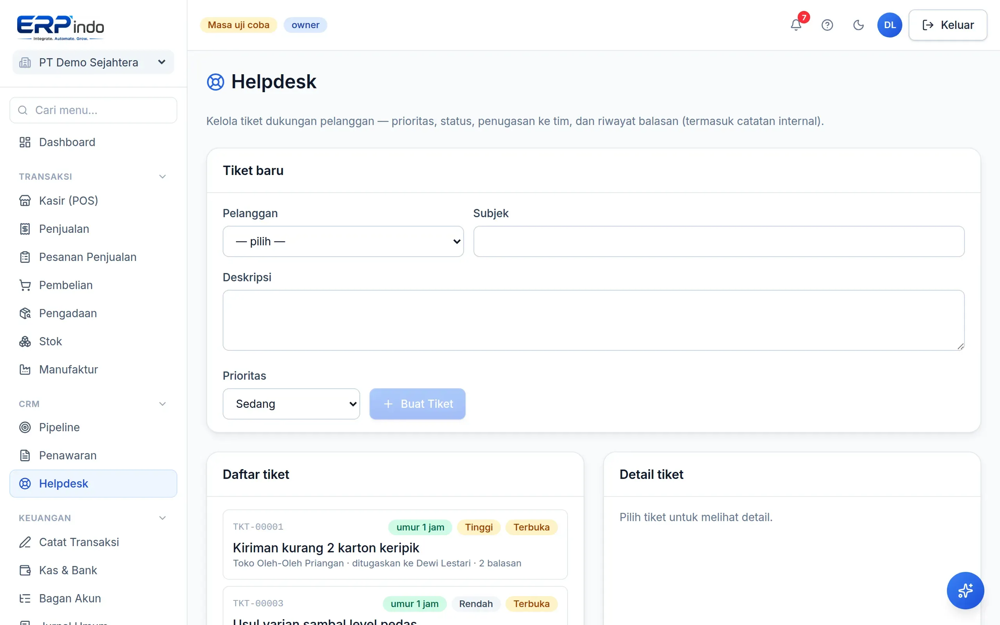

# Helpdesk

Tiket dukungan pelanggan dengan prioritas, penugasan ke anggota tim, balasan untuk pelanggan, dan catatan internal tim.

> Buka di aplikasi: `/app/helpdesk`

## Mengelola tiket

1. Buat tiket terhubung ke kontak, pilih prioritas (low/medium/high).
2. Balas ke pelanggan atau tulis catatan internal (tidak terlihat pelanggan); tugaskan ke anggota tim.
3. Tandai selesai — waktu penyelesaian tercatat.

