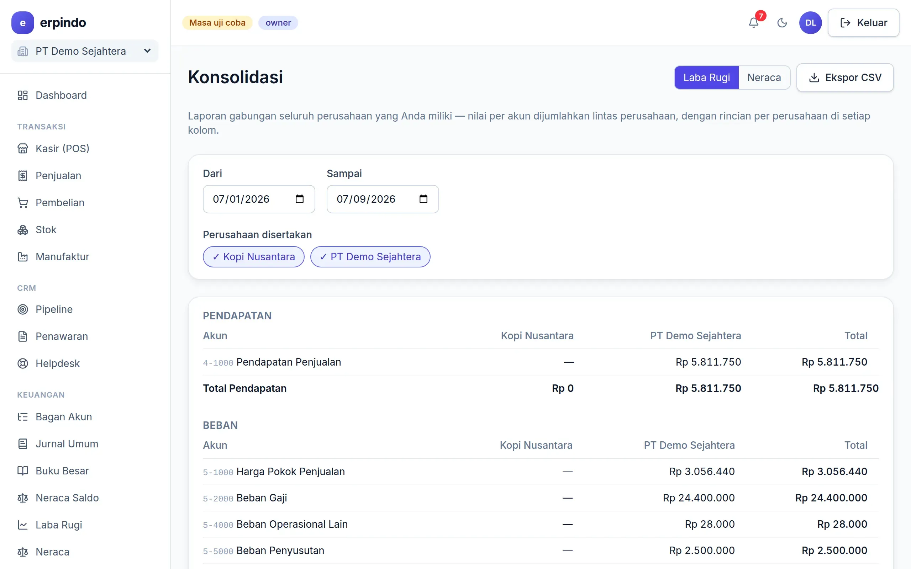

# Multi-Perusahaan & Konsolidasi

Punya beberapa badan usaha? Buat semuanya dari satu akun — data tiap perusahaan tetap terpisah total — lalu lihat Laba Rugi & Neraca gabungan.

> Buka di aplikasi: `/app/konsolidasi`

## Menambah perusahaan & laporan gabungan

1. Di pengalih perusahaan (kiri atas) pilih "Tambah perusahaan" — database baru dibuat otomatis.
2. Berpindah workspace kapan saja lewat pengalih yang sama.
3. Halaman Konsolidasi menjumlahkan Laba Rugi & Neraca semua perusahaan milik Anda.

