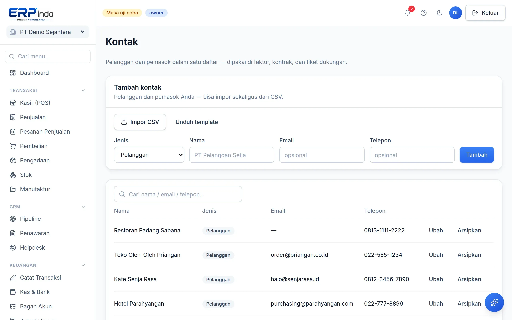

# Pelanggan & Pemasok

Satu daftar untuk pelanggan dan pemasok, lengkap dengan NPWP (untuk e-Faktur), alamat, dan riwayat transaksinya.

> Buka di aplikasi: `/app/master/kontak`

## Menambah kontak

1. Pilih tipe: Pelanggan, Pemasok, atau Keduanya.
2. Isi NPWP untuk pelanggan ber-PPN — dipakai otomatis di ekspor e-Faktur & XML Coretax.

> 💡 Kontak juga bisa diimpor massal dari CSV, sama seperti produk.
