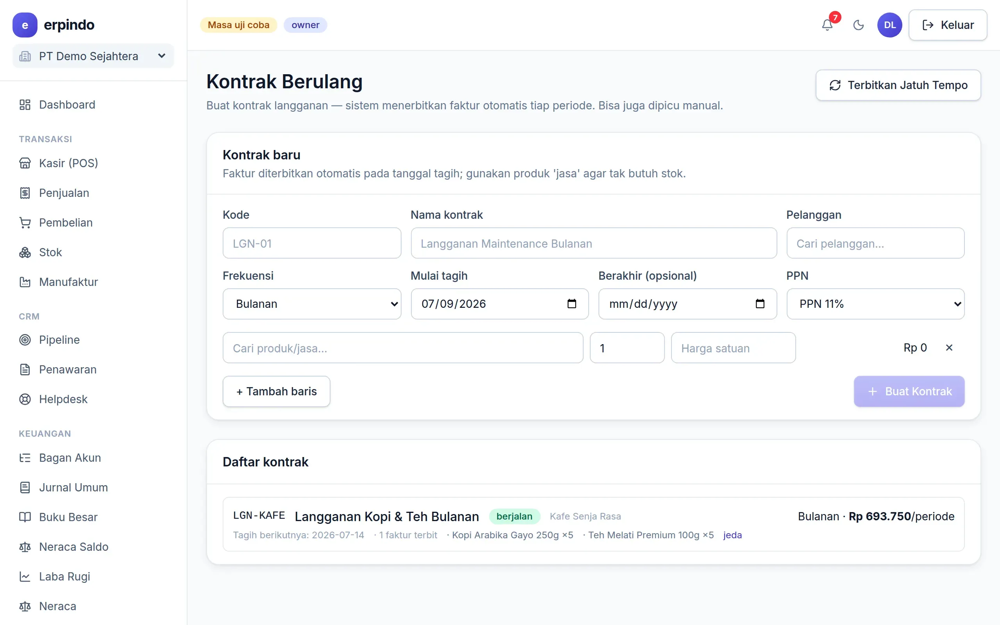

# Kontrak & Tagihan Berulang

Langganan bulanan pelanggan (jasa maintenance, sewa, pasokan rutin) ditagih otomatis: sistem menerbitkan faktur setiap periode tanpa Anda ingat-ingat.

> Buka di aplikasi: `/app/kontrak`

## Membuat kontrak berulang

1. Buat kontrak: pelanggan, frekuensi (bulanan), tanggal mulai, dan baris item + harga.
2. Setiap jatuh tempo, faktur terbit otomatis (lewat cron harian) — muncul di menu Penjualan seperti faktur biasa.

