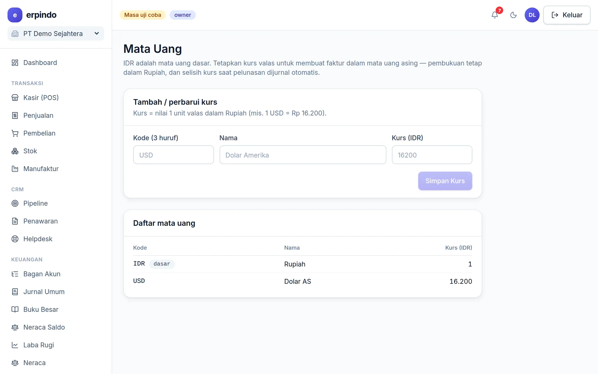

# Multi Mata Uang

Terima order ekspor atau beli dari luar negeri: faktur valas dikonversi ke Rupiah saat posting, selisih kurs saat pelunasan dijurnal otomatis.

> Buka di aplikasi: `/app/keuangan/kurs`

## Kurs & faktur valas

1. Daftarkan mata uang & kursnya di halaman Mata Uang (mis. USD 16.200).
2. Di form faktur, pilih mata uang + kurs transaksi — pembukuan tetap dalam Rupiah.
3. Saat pembayaran dengan kurs berbeda, laba/rugi selisih kurs terjurnal otomatis.

