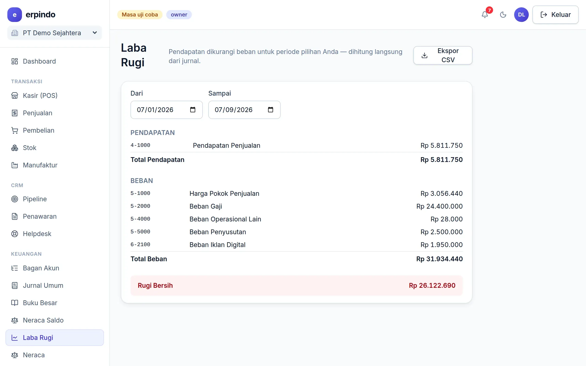
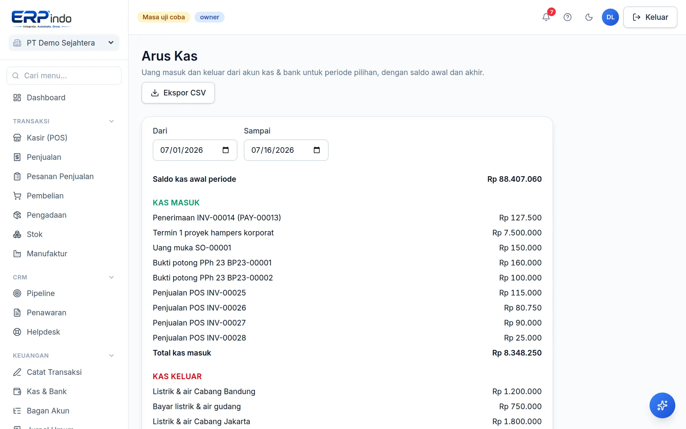

# Laporan Keuangan

Laba Rugi, Neraca, Arus Kas, dan Umur Piutang/Hutang — semuanya dihitung real-time dari jurnal, bisa diekspor CSV dan dicetak.

> Buka di aplikasi: `/app/keuangan/laba-rugi`

## Laba Rugi & Neraca

Pilih periode → laporan tampil seketika. Neraca menyertakan laba berjalan sehingga selalu seimbang. Karena satu sumber (jurnal), angka antar laporan tidak mungkin saling bertentangan.

## Arus Kas & Umur Tagihan

Arus Kas menampilkan uang masuk/keluar per keterangan jurnal — memudahkan melihat ke mana kas mengalir. Umur Piutang/Hutang mengelompokkan tagihan per usia (lancar, 1–30, 31–60, 61–90, >90 hari) agar penagihan terprioritas.

## Anggaran vs realisasi

Tetapkan target pendapatan & beban per akun per bulan di halaman Anggaran — realisasi terisi otomatis dari jurnal, selisihnya diberi warna.
