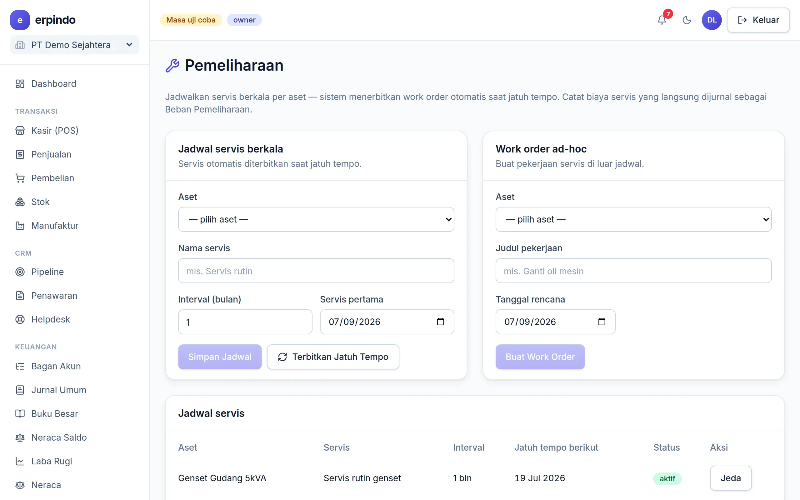

# Pemeliharaan Aset

Jadwal servis berkala untuk aset (kendaraan, mesin, genset) yang menerbitkan work order otomatis, plus work order ad-hoc dengan biaya terjurnal.

> Buka di aplikasi: `/app/maintenance`

## Jadwal servis & work order

1. Buat jadwal: aset, nama servis, interval bulan, tanggal mulai — work order terbit otomatis saat jatuh tempo.
2. Selesaikan work order dengan biaya & akun pembayar — beban pemeliharaan terjurnal; riwayat per aset tersimpan.

