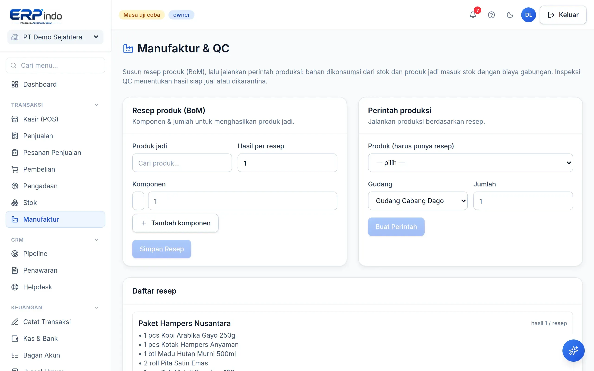

# Manufaktur & QC

Untuk yang memproduksi barang: resep (Bill of Materials), perintah produksi yang mengubah bahan menjadi barang jadi dengan biaya gabungan, plus inspeksi mutu.

> Buka di aplikasi: `/app/manufaktur`

## BoM → produksi → QC

1. Definisikan BoM: komponen & jumlahnya untuk menghasilkan sekian unit barang jadi.
2. Buat perintah produksi → Selesaikan: stok bahan keluar, barang jadi masuk dengan biaya gabungan bahan.
3. Inspeksi QC: luluskan hasil produksi, atau karantina ke gudang terpisah bila bermasalah.

