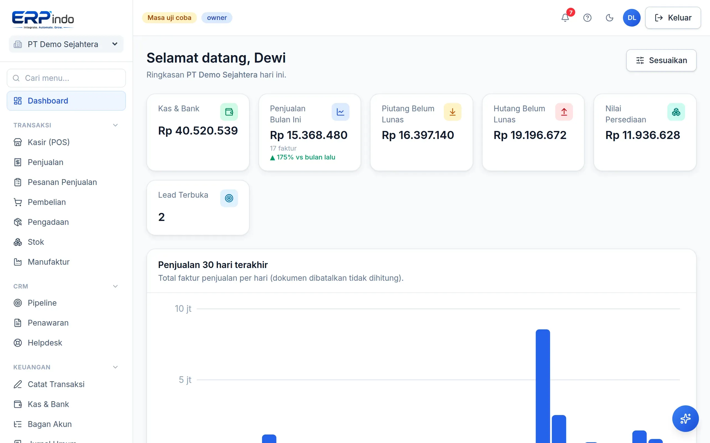

# Mulai Cepat

Dari daftar sampai faktur pertama dalam hitungan menit. Panduan ini merangkum langkah awal yang disarankan agar pembukuan Anda langsung berjalan rapi.

> Buka di aplikasi: `/app`

## Daftar & masuk

1. Buka halaman Daftar, isi nama perusahaan, nama Anda, email, dan kata sandi.
2. Sistem otomatis membuatkan database khusus untuk perusahaan Anda + bagan akun standar Indonesia (22 akun).
3. Verifikasi email lewat tautan yang dikirim — lalu Anda langsung berada di Dashboard.

> 💡 Uji coba 30 hari mencakup SEMUA fitur, tanpa kartu kredit.

## Ikuti checklist "Mulai cepat"

Dashboard tenant baru menampilkan checklist berprogres: lengkapi profil perusahaan (alamat & NPWP), tambah produk, tambah kontak, posting faktur pertama, dan undang tim. Checklist hilang sendiri saat semuanya selesai.

## Alur harian yang umum

Penjualan tunai di toko → pakai Kasir (POS). Penjualan dengan tagihan → buat Faktur di menu Penjualan. Belanja stok → menu Pembelian. Semua transaksi otomatis membuat jurnal dan menggerakkan stok — Anda tidak perlu mencatat dua kali.
