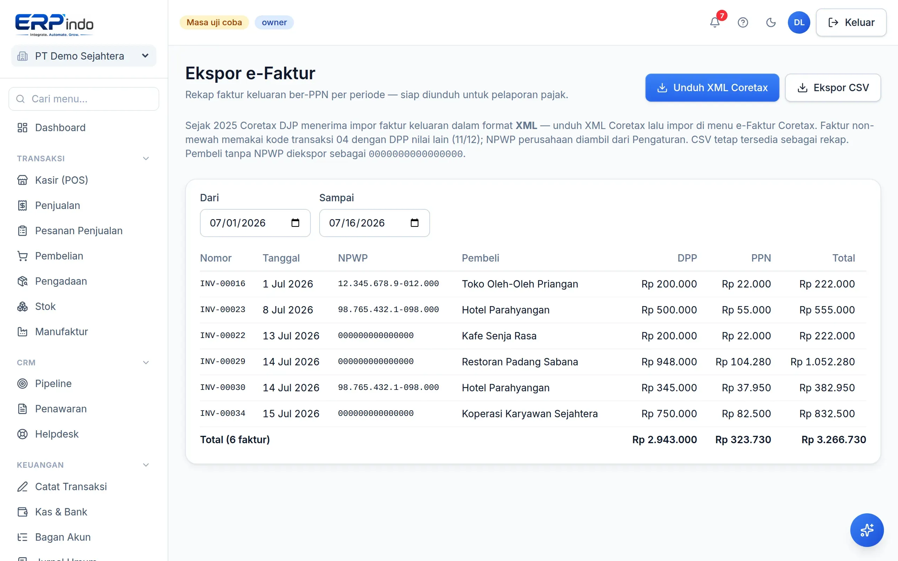

# Pajak & e-Faktur Coretax

PPN dihitung otomatis di setiap faktur (0/11/12%), dan faktur keluaran bisa diunduh sebagai XML siap impor ke Coretax DJP — format satu-satunya yang diterima sejak 2025.

> Buka di aplikasi: `/app/keuangan/e-faktur`

## Ekspor XML Coretax

1. Pastikan NPWP perusahaan terisi di Pengaturan, dan NPWP pembeli terisi di Kontak.
2. Buka Ekspor e-Faktur → pilih periode → "Unduh XML Coretax".
3. Impor berkas di Coretax DJP (menu e-Faktur → Impor Faktur Keluaran).

> 💡 Kode transaksi otomatis: 04 dengan DPP nilai lain 11/12 untuk non-mewah (PMK 131/2024), 01 untuk tarif 12% penuh.
> 💡 Faktur yang dibatalkan dan non-PPN otomatis dikecualikan. CSV rekap tetap tersedia.
