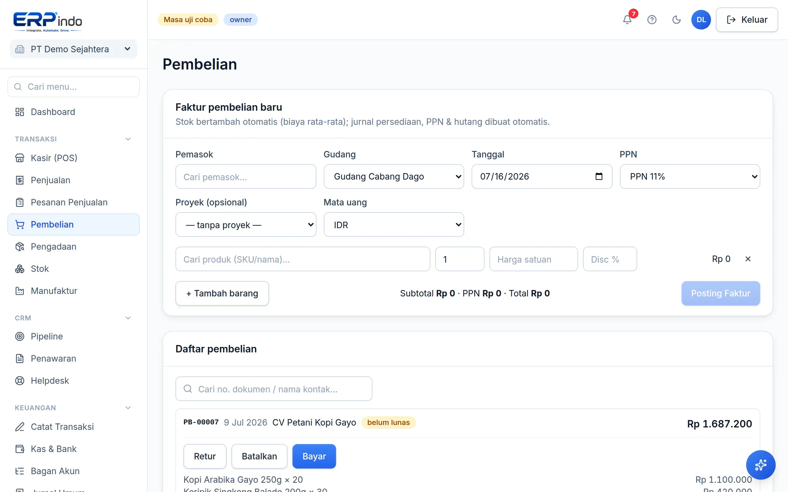

# Pembelian

Faktur pembelian mengisi stok dengan biaya rata-rata otomatis, mendukung lot kedaluwarsa, diskon per baris, PPN Masukan, dan hutang usaha.

> Buka di aplikasi: `/app/pembelian`

## Mencatat pembelian

1. Pilih pemasok, gudang tujuan, tarif PPN, dan baris produk.
2. Untuk produk berpelacakan kedaluwarsa, isi nomor lot & tanggal exp per baris.
3. Posting: Persediaan & PPN Masukan terjurnal, stok masuk pada biaya setelah diskon, hutang tercatat sampai dibayar.

> 💡 Pembelian oleh Admin di atas ambang tertentu bisa diwajibkan menunggu persetujuan Owner — lihat modul Persetujuan.
