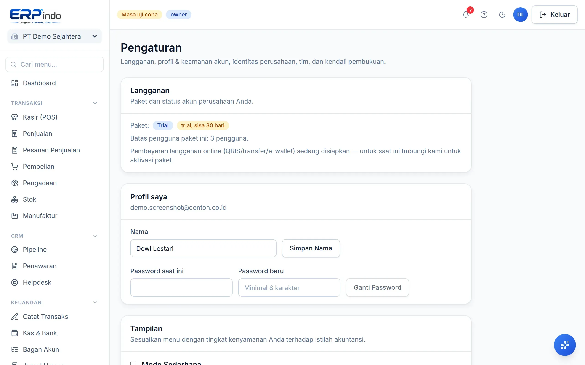

# Pengaturan & Tim

Profil perusahaan, logo kop faktur, anggota tim dengan peran berbeda, keamanan 2FA, dan tutup buku — semuanya di halaman Pengaturan.

> Buka di aplikasi: `/app/pengaturan`

## Profil perusahaan & logo

1. Isi nama tampilan, alamat, dan NPWP (dipakai di kop faktur & ekspor e-Faktur/Coretax).
2. Unggah logo — otomatis dikecilkan dan tampil di cetakan faktur serta struk kasir.

## Undang tim dengan peran

1. Buka bagian Anggota → Undang, masukkan email dan pilih peran.
2. Owner: kendali penuh termasuk tutup buku & audit log. Admin: mengelola transaksi & master data. Viewer: hanya melihat.

> 💡 Pembelian besar oleh Admin bisa diwajibkan lewat persetujuan Owner — atur ambangnya di halaman Persetujuan.

## Keamanan & tutup buku

Aktifkan verifikasi dua langkah (2FA) dengan aplikasi authenticator. Tutup buku mengunci semua transaksi sampai tanggal tertentu — jurnal baru di periode terkunci otomatis ditolak.
