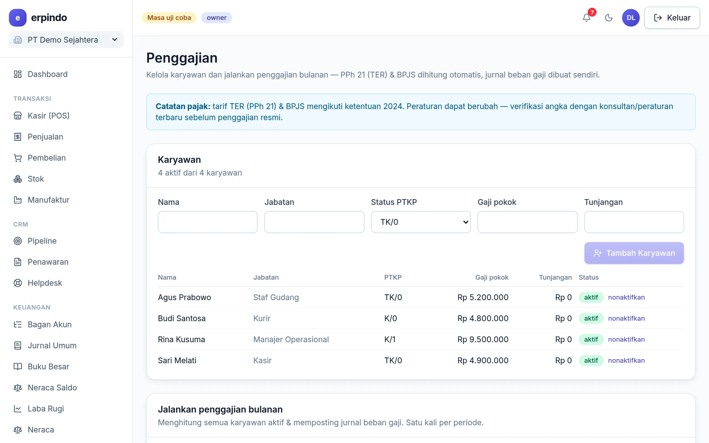

# Penggajian & PPh 21

Data karyawan, gaji pokok & tunjangan, lalu jalankan penggajian bulanan sekali klik — PPh 21 metode TER dan BPJS dihitung otomatis, slip gaji siap cetak, beban gaji terjurnal.

> Buka di aplikasi: `/app/hr/penggajian`

## Karyawan & run penggajian

1. Tambah karyawan: nama, jabatan, status PTKP (TK/0, K/1, dst.), gaji pokok & tunjangan.
2. Jalankan penggajian per bulan: pilih periode, akun pembayar, dan tanggal bayar.
3. Sistem menghitung PPh 21 (tarif efektif rata-rata/TER sesuai PMK 168/2023) + potongan BPJS Kesehatan & Ketenagakerjaan, mencetak slip per karyawan, dan menjurnal beban gaji.

> 💡 Parameter tarif (TER, batas upah BPJS) tersimpan dalam tabel yang mudah diperbarui saat aturan berubah — verifikasi akhir dengan konsultan pajak Anda tetap disarankan.
