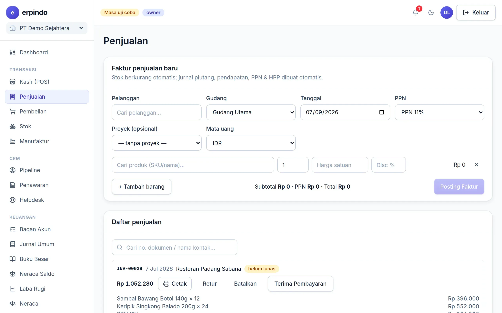

# Penjualan & Faktur

Faktur penjualan dengan PPN & diskon per baris, pencatatan pembayaran sampai lunas, retur, dan pembatalan yang aman secara akuntansi.

> Buka di aplikasi: `/app/penjualan`

## Membuat faktur

1. Pilih pelanggan (ketik untuk mencari), tanggal, jatuh tempo, dan tarif PPN (0/11/12%).
2. Tambahkan baris produk — harga terisi otomatis, diskon % per baris opsional.
3. Posting: jurnal (Piutang, Pendapatan, PPN Keluaran, HPP, Persediaan) dan stok keluar terjadi otomatis. Cetak/PDF berkop tersedia.

## Pembayaran, retur, & pembatalan

1. Catat pembayaran (bisa bertahap) — status berubah ke Lunas otomatis.
2. Retur: pilih faktur → Retur → jumlah per baris; nota kredit + stok masuk kembali terjurnal proporsional (termasuk PPN).
3. Salah input & belum dibayar? Batalkan — sistem memposting jurnal pembalik persis dan mengembalikan stok pada biaya asal.

> 💡 Faktur dalam mata uang asing? Set kurs di halaman Mata Uang lalu pilih mata uang di form faktur.
