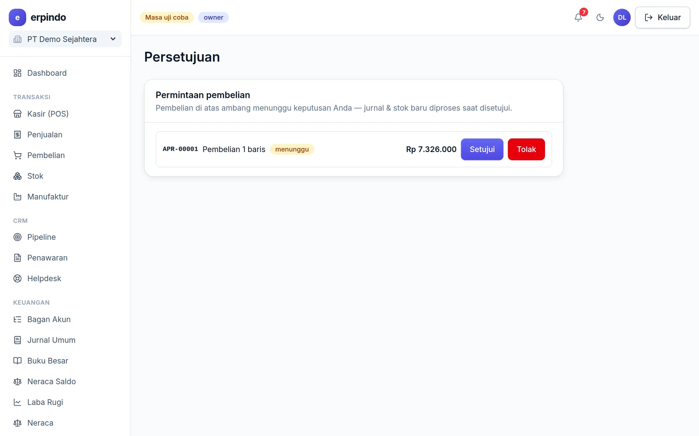

# Persetujuan Pembelian

Kontrol pengeluaran: pembelian oleh Admin di atas ambang nominal harus disetujui Owner sebelum diposting.

> Buka di aplikasi: `/app/persetujuan`

## Cara kerjanya

1. Owner mengatur ambang (mis. Rp 5.000.000) di halaman Persetujuan.
2. Pembelian Admin di bawah ambang langsung diposting; di atasnya masuk antrean menunggu.
3. Owner menyetujui (transaksi diposting persis seperti diajukan) atau menolak dengan alasan.

