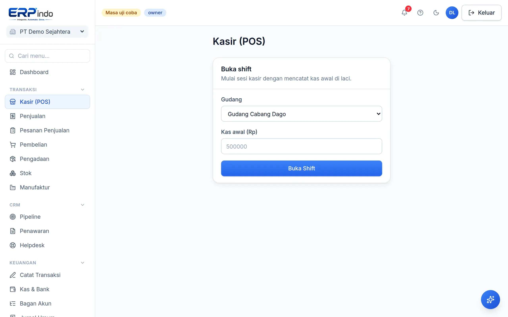

# Kasir (POS)

Layar kasir cepat untuk penjualan tunai di toko: shift kas, pencarian produk kilat, diskon per item, struk berlogo, dan tetap berjalan saat offline.

> Buka di aplikasi: `/app/pos`

## Buka shift, jual, tutup shift

1. Buka shift: pilih gudang & isi kas awal laci.
2. Cari produk (ketik nama/SKU), atur jumlah & diskon per item, terima uang tunai — kembalian dihitung otomatis, struk siap cetak.
3. Tutup shift di akhir hari: hitung kas fisik — selisih kas otomatis dijurnal sehingga pembukuan tetap jujur.

## Yang terjadi di balik layar

Setiap penjualan POS = faktur lunas: pendapatan & HPP terjurnal, stok berkurang (dengan biaya rata-rata), dan kas laci bertambah. Rekap shift masuk ke buku besar tanpa Anda menyentuh jurnal.

> 💡 Sebagai PWA, halaman kasir tetap terbuka saat internet putus — transaksi tersinkron saat koneksi kembali.
