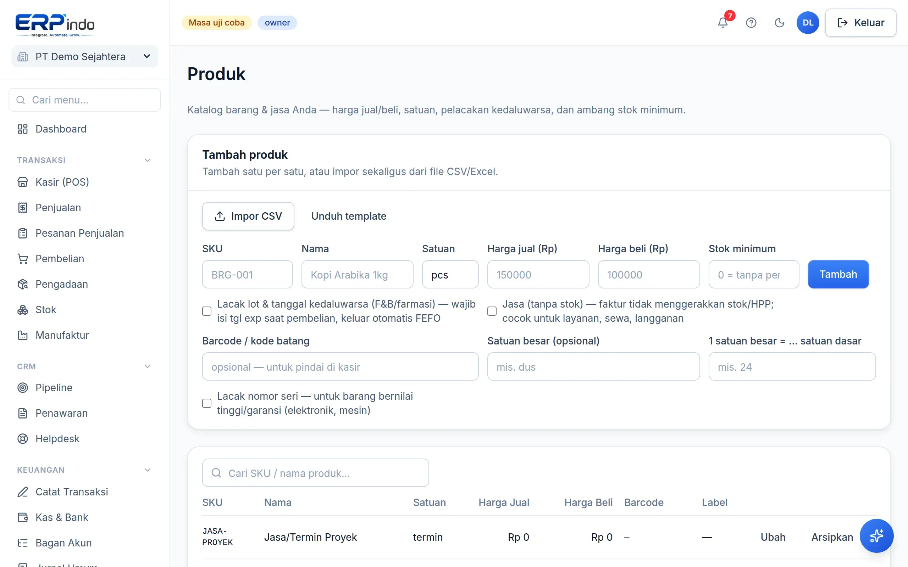

# Produk & Jasa

Katalog barang dan jasa Anda: harga jual/beli, satuan, ambang stok minimum, pelacakan kedaluwarsa, dan impor massal dari Excel.

> Buka di aplikasi: `/app/master/produk`

## Menambah & mengubah produk

1. Isi SKU (kode unik), nama, satuan, harga jual & beli, lalu Simpan.
2. Centang "Jasa" untuk item tanpa stok (mis. ongkos kirim, jasa servis).
3. Centang "Lacak kedaluwarsa" untuk produk ber-lot (makanan/obat) — penjualan otomatis mengambil lot paling dekat kedaluwarsa (FEFO).
4. Isi "Stok minimum" agar lonceng notifikasi mengingatkan sebelum kehabisan.

## Impor dari Excel/CSV

1. Klik Impor → unduh contoh format → isi di Excel → simpan sebagai CSV.
2. Unggah, periksa pratinjau per baris, lalu konfirmasi. Baris bermasalah dilaporkan satu per satu.
