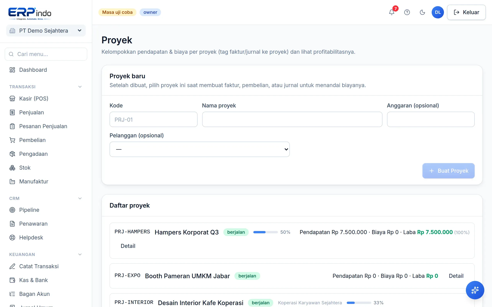

# Proyek

Untuk usaha berbasis proyek: pantau tugas, tandai pendapatan & biaya per proyek dari faktur/jurnal, dan lihat profitabilitas tiap proyek.

> Buka di aplikasi: `/app/proyek`

## Proyek, tugas, dan profitabilitas

1. Buat proyek dengan kode & anggaran; tambahkan tugas dan tandai selesai.
2. Saat membuat faktur atau jurnal, pilih proyek terkait — pendapatan/biaya otomatis ter-tag.
3. Detail proyek menampilkan realisasi vs anggaran dan laba proyek berjalan.

