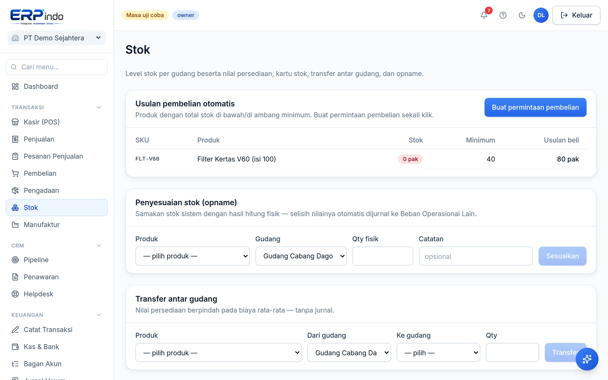

# Stok & Gudang

Level stok multi-gudang dengan nilai persediaan real-time, kartu stok per produk, transfer antar gudang, opname, dan lot kedaluwarsa FEFO.

> Buka di aplikasi: `/app/stok`

## Memantau & menelusuri stok

Tabel stok menampilkan jumlah, biaya rata-rata, dan nilai per produk per gudang — angkanya selalu sama dengan akun Persediaan di neraca. Klik produk untuk melihat kartu stok (riwayat masuk/keluar + saldo berjalan).

## Transfer, opname, & kedaluwarsa

1. Transfer: pindahkan stok antar gudang — nilai persediaan tidak berubah, tanpa jurnal.
2. Opname: masukkan jumlah fisik hasil hitung — selisihnya otomatis dijurnal sebagai penyesuaian.
3. Lot kedaluwarsa: penjualan otomatis mengambil lot ter-dekat exp (FEFO); peringatan muncul untuk lot yang akan kedaluwarsa ≤ 30 hari.
